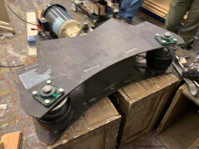

# Turntable Traction Drive Project

<image alt="Design Render" src="images/design-render.jpg" width=600 />

This is my design for a Turntable Traction Drive. It's meant to turn a large theatrical turntable covered in sets and actors in a safe reliable way. It can be built for less than $3000 USD.

I was inspired to take on this project by Alan Hendrickson's chain-driven design featured in [Technical Designs Solutions for Theatre Volume 2 (Sammler/Harvey 2002)](https://www.amazon.com/Technical-Design-Solutions-Theatre-Collection/dp/0240804929). His design shows how a chain drive can rotate a turntable. I was interested in designing an easier-to-integrate "bolt-on" solution.

Feel free to make your own or iterate on this in any way permitted by the [license](../LICENSE)! If you do happen to build one, send me a picture, I'd love to share it!

## Critical Documents

| Document Name | Description |
| -- | -- |
| [Creative Commons Attribution 4.0 International](LICENSE) | The license under-which these plans are made available. |
| [Bill Of Materials](BOM.md) | A list of the parts required to build this machine. |
| [Custom Parts Overview](TurntableTractionDrive-PartsOverview.pdf) | A one-page PDF helpful when ordering custom cut steel. |
| [Design Document](DESIGN.md) | Discussion of design and considerations made. |
| [Assembly Guide](ASSEMBLY.md) |  Instructions on how to build your own Turntable Traction Drive.  |
| [Integration Guide](INTEGRATION.md) | Instructions on how to integrate this machine into your set desgin. |
| [Operation Guide](OPERATION.md) | Instructions on how to operate this machine. |

## Checklists

| Document Name | Description |
| -- | -- |
| [Integration Checklist](INTEGRATION.md#integration-checklist) | A list of integration requirements for safe scenic integration of the Turntable Traction Drive. |
| [Operations Checklist](OPERATION.md#operations-checklist) | A "preshow" checklist to verify before each use of the Turntable Traction Drive. |

## Part Files

| Part | Description |
| -- | -- |
| [Chassis Parts](dxfs/) | 2D CAD drawings of chassis parts to be cut from 1/4" mild steel. | 
| [Safety Placard](TurntableTractionDriveLabel.pdf) | A PDF to be made into a printable label and applied to the top of the chassis. | 

## Media

- [Assembled Chassis Before Welding (photo)](parts-fitup.jpg)
  
  <image alt="Assembled Chassis Before Welding (photo)" src="images/parts-fitup.jpg" width=400 />

- [Initial Bench Test (video)](https://youtu.be/k4kjQTp1Dig)
  
  

- [Startup Run (video)](https://youtu.be/NJ8Oi7qZh6Y)

  

- [Full Speed Run of 23' Turntable (video)](https://youtu.be/Ed3DXH9XDa4)

  
  
- [Full Speed Run of 6' Turntable (video)](https://youtu.be/193OzLW5t50)

  
  
- [Rehearsing on a 6' Turntable (video)](https://youtu.be/gqXYZ6G5New)

  

## Turntable Traction Drive Specifications

| Traction Drive Feature |  Detail |
| -------------- | ------------------------------|
| Design Units | **INCHES** |
| Height | 9.875" |
| Width | 32.875" |
| Depth |  33" |
| Chassis Weight | ~112 Lbs |
| Total Weight | ~228 Lbs |
| Number of Parts | 63 |
| Minimum Turntable Size | 6' Diameter |
| Maximum Turntable Size | Proven on a 23' diameter Turntable with steel and wood scenery. |

### Powerplant Details

My motor decision was based on what I had lying around. You may easily sub in your own motor, but for simplicity of integration try to pick a motor matching NEMA Frame 145TC. Otherwise you may have to drill new holes in the `Base Plate` and `Motor Gusset`.

| Powerplant Feature |  Detail |
| -------------- | ------------------------------|
| Model | General Electric 2HP TEFC (5KE48WN8167) |
| Speed | 1725 RPM at 60Hz |
| Layout | NEMA Frame 145TC |
| Gearhead | Morse 175Q140LR5 |
| Gearhead Ratio | 5:1 |

### Control Details

In order to vary the speed of drive motor we must use a Variable Frequency Drive (VFD). The VFD will be responsible for managing the speed and acceleration of the traction drive. Choosing the right motor controller is therefore key to the reliability and safety of the system. 

| VFD Feature |  Detail |
| -------------- | ------------------------------|
| Model | Hitachi L-100 (L100-007NFU)  |
| Input Power | 120VAC 15A |
| Output Power | 0.75 KW (1 HP) |
| Output Range | 0 - 360Hz |
